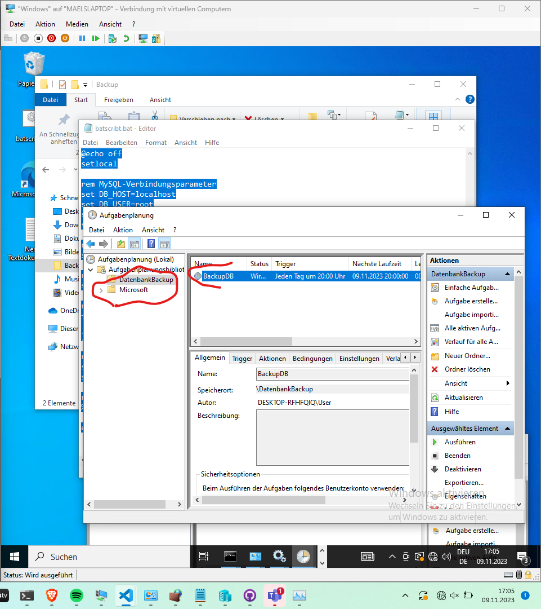
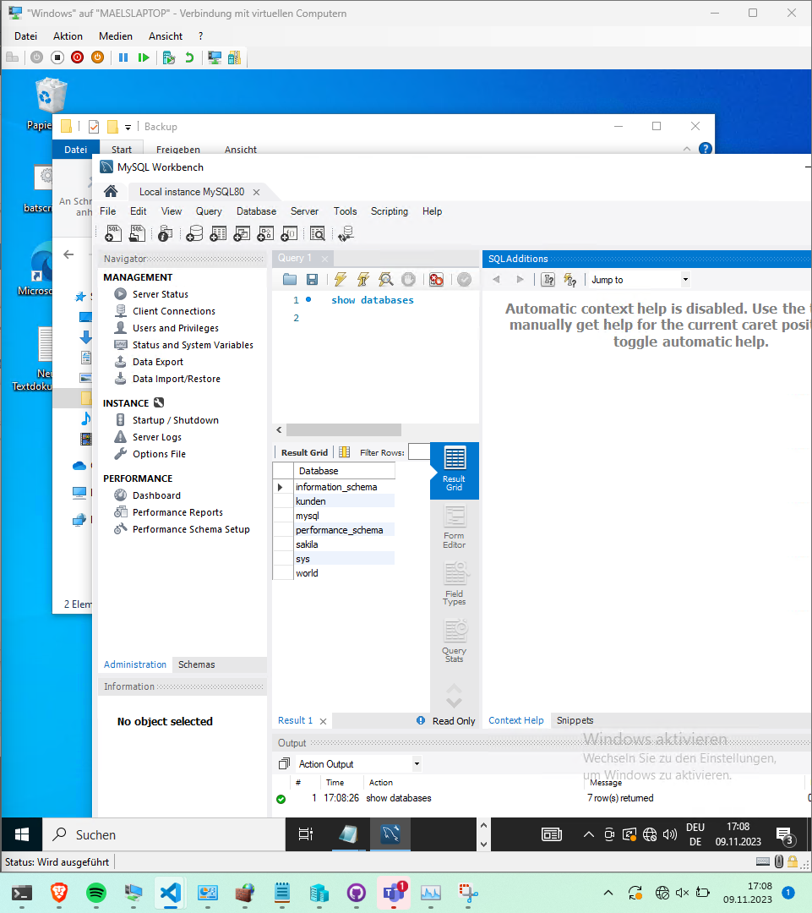
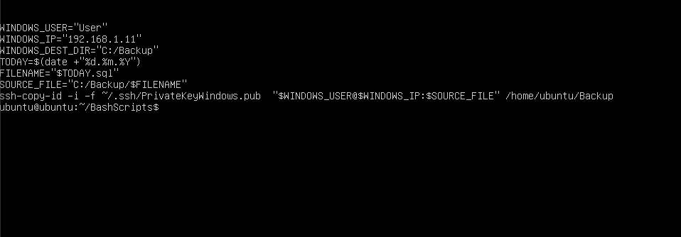
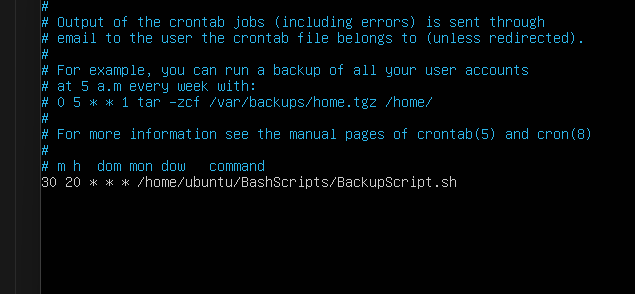

# DataShield Datensicherungs lösung für unternehmen.

Ich möchte ein Produkt entwerfen bei dem man seine daten auf einem True nas server speichern kann und sich als client diese daten auch beziehen kann. Dann möchte ich es auch schaffen das es ein Backup des nas servers gib das an einem externen standort.

## Instalation TrueNas au HyerV-Manager
Ich habe mich für ein TrueNas als File server entschieden. Weil das für mich als die beste option erscheint da ich noch nicht damit gearbeitet habe und es so eine challenge für mich ist. Auch das es uns empfolen wurde und wir eine Anleitung für die installation erhalten haben hat mich dazu bewegt ein TrueNas zu verwenden. Jetzt zur installation. Ich habe meinem True nas 4 gb ram vergeben und eine Festplatte von 50gb. Eigentlich sind 8gb empfohlen jedoch brauche ich diese VM nur für testzwecke deshalt sollte dies reichen. Ich habe jetzt den server fertig aufgesetzt und kann per gui über den browser auf diesen server per GUI zugreifen.Ich habe eine statische ip adresse gesetzt damit ich leichter darauf zugreifen kann. Jetzt habe ich einen Linux server aufgesetzt und mit diesem Den nas server angeping und umgekehrt damit ich sicher sein kann das dass funktioniert mit der Verbindung.

Datensicherungskonzept

Datensicherheitskonzept:

Das Datensicherungssystem wird für die CRM Datenbank eines kleineren Elektrikrer-Betriebes konzipiert. Die Auslegung basiert auf den Empfehlungen der BSI CON.3 Datensicherungskonzept.

Auf Grund des Geschäftsmodell der Firma besteht keine regulatorische Pflicht die Daten länger aufzubewahren und es muss keine Archivierungslösung implementiert werden.

Rahmenbedingung für das Datensicherungskonzept.

Durch verschiedene Gespräche mit Businessvertretern wie auch den Fachverantwortlichen aus dem IT-Betrieb wurden folgende Rahmenbedingungen definiert:

• Speichervolumen:

o CRM Datenbankgrösse aktuell: 350GB

• Änderungsvolumen:

o Zunahme der CRM Datenbank war in der Vergangenheit ca. 10% /a

• Änderungszeitpunkte:

o Änderungszeitpunkt ist während den normalen Geschäftszeiten

o Der Backup wird nach Ende des Businesstages um 20Uhr gestartet.

• Verfügbarkeitsanforderungen:

o Der Geschäftsbetrieb könnte einen Tag ohne die Datenbank weitergeführt und nachgetragen werden

• Integritätsbedarf

• rechtliche Anforderungen

o Es bestehen keine rechtliche Anforderungen oder Archivierungspflicht. Die üblichen GDPR Gesetze können über die CRM Applikation sichergestellt werden.

• Speichermedien

o 1 ubuntu Server 
• Transportmodalitäten

o

• Aufbewahrungsmodalität

o Die Sicherungskopien werden 4 Tage zurück aufbewahrt.

• Datensicherungstests

## Tagesrefelxion

27.10.2023

Ich habe heute mit Herr Rohr über mein Datensicherungskonzept gesprochen. Wir haben es analysiert und ich bin auf dem Guten weg ich müsste Jedoch noch das GeBüv beachten das habe ich heute noch nicht getan. Ich habe jedoch mein TrueNas erfolgreich neu afgesetzt das es mir am Anfang nicht möglich war einen Datenpool zu erstellen da es beim HyperV manager nicht möglich ist eine zusätzliche Festplatte mitzugeben beim erstellen einer VM. Oder ich habe einfach nicht herausgefunden wie. Jedoch habe ich dan nochmals die Einstellungen analysiert und herausgefunden das man nachträglich eine Zusätzliche Fesplatte hinzufügen kann. Das habe ich heute erreicht und habe es die dletzten Wochen for mir hergeschoben da ich dachte das wäre mit dem HyperV nicht möglich ich jedoch auch nicht die applikation zum starten der Vms wechseln wollte da ich mit HyperV sehr gute Erfahrungen gemacht habe.

Ich bin vorallem mit der Planung weiter gekommen da ich mir jetzt mein Endprodukt konkret vorstellen kann. Ich habe auch schon im kopf wie ich es umsetzten werde jedoch gibt es noch ein paar Schen die mir noch unklar sind wie ich sie Lösen werde. Ich habe die Aufgabe verschoben mir zu überlegen wie ich eine Datenbank erstelle die ich nacher BAckupen will jedoch habe ich schon die Verbindungen zwischen den verschiedenen Clients überprüft und die funktioniert. Ein unnötiger Zeitfreeser war das ich als mein NAS Korrupt war oder einfach nicht mer funktioniert hatt das ich versucht habe das zu reparieren ob wohl ich auf diesem NAS sonst noch nichts gemacht habe und es 100 mal schneller gewesen wäre war es einfach neu aufzusetzten.

##
Umsetzung backup 

Ich habe mir überlegt das ich die Datenbank auf einem Windows Client installiere. Ich denke das ist die Beste lösung da Es für mitarbeitende zu Kompliziert wäre auf einem Linux zu arbeiten. Um die Datenbank zu Hosten habe ich MySql verwendet da ich das schon kannt aus anderen modulen und die comunity version gratis ist. Nachdem ich Mysql installiert habe habe ich eine datenbank namens Kunden aufgesetzt. Damit ein Datenbank Backup möglich ist habe ich mit der Windows Aufgabenplanung eine Aufgabe erstellt die Jeden Abend um 8 Uhr ein Dump der Datenbank erstellt.

Code Der Windows Aufgabe für den DB dump

@echo off
setlocal

rem MySQL-Verbindungsparameter
set DB_HOST=localhost
set DB_USER=root
set DB_PASSWORD=Schubiger.123
set DB_NAME=Kunden

rem Pfad zum mysqldump-Befehl (normalerweise im MySQL-Installationsverzeichnis)
set MYSQL_DUMP_PATH="C:\Program Files\MySQL\MySQL Server 8.0\bin\mysqldump.exe"

rem Verzeichnis, in dem der Dump gespeichert werden soll
set DUMP_DIR=C:\Backup

rem Heutiges Datum im Format JJJJ-MM-TT
for /f "tokens=1-3 delims=/-" %%a in ("%DATE%") do (
    set TIMESTAMP=%%c-%%b-%%a
)

rem Dateiname für den Dump (mit Zeitstempel)
set DUMP_FILENAME=%TIMESTAMP%.sql
set DUMP_DBBACKUP=%DUMP_DIR%\%DUMP_FILENAME%

rem Führen Sie den Dump-Befehl aus
%MYSQL_DUMP_PATH% -h %DB_HOST% -u %DB_USER% -p%DB_PASSWORD% %DB_NAME% > %DUMP_DBBACKUP%

endlocal

Danach habe ich auf einem ubuntu server ein Scribt erstellt das per scp dieses erstellte File auf den ubuntu Server kopiert. Dieses script ist extra so geschrieben das es das File von Heute kopiert wird.

Dieses script löscht jeden abend um 9uhr die älteste Datei lässt jedoch 3 stehen. Dies führe ich auch mit der windows Aufgabenplanung durch
@echo off
setlocal

set "Ordner=C:\Backup"

set Anzahl=3

for /f "skip=%Anzahl% delims=" %%i in ('dir /b /a-d /o-d "%Ordner%"') do (
     del "%Ordner%\%%i"
)

endlocal

Hier der Cron job für das Backupscript

## Wiso habe ich es so Gelöst

1. Datensicherheit:#
Durch regelmäßige Backups werden Daten vor Verlust geschützt. Falls ein unerwarteter Fehler auftritt, können die Daten aus dem Backup wiederhergestellt werden.

2. Wiederherstellbarkeit:
Wenn Daten versehentlich gelöscht oder beschädigt werden, können Sie aus dem Backup zurückgeholt werden.

3. Kontinuität:
Ein tägliches Backup stellt sicher, dass stets eine aktuelle Kopie der Daten verfügbar ist. Bei einem Ausfall kann der Betrieb nahtlos fortgesetz werden.

4. Effizienz: 
Automatisierte Backups sparen Zeit und Aufwand im Vergleich zu manuellen Sicherungsprozessen.

5. Skalierbarkeit: 
Die Skripte für tägliche Backups können leicht angepasst werden, um zusätzliche Datenbanken oder Server hinzuzufügen.

6. Geografische Trennung:
Durch das Speichern des Backups auf einem anderen Server (Ubuntu) wird eine geografische Trennung erreicht. So sind die Daten auch bei physischen Schäden am Windows Client geschützt.

7. Angriffe:
Eine Attacke durch Ransomware ist unmöglich mit zwei verschiedenen Betriebsystemen.

8. Benutzerfreundlichkeit
Viele normale Mitarbeiter haben keine erfahrung mit Linux. es ist für sie viel einfacher und übersichtlicher auf einem Windows Client.
